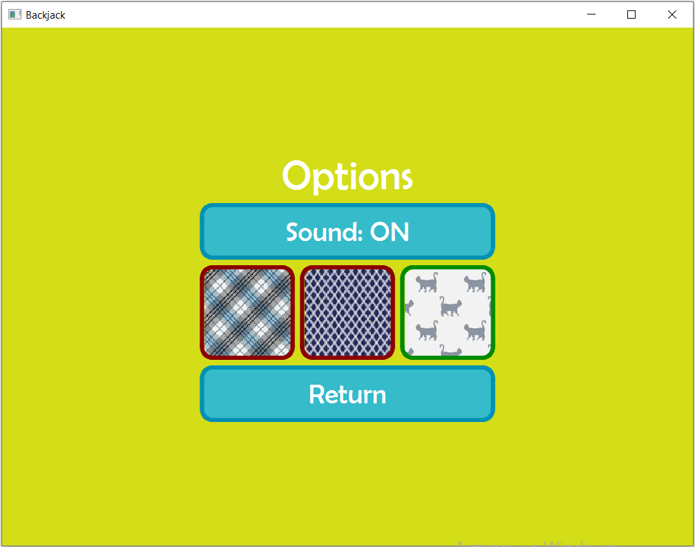

Після запуску додатку буде відображено головну сторінку

Головна сторінка

Для переходу на сторінку налаштувань необхідно натиснути на кнопку **_Options_**

Сторінка налаштувань

На сторінкі налаштувань змінити рубашку гральних карток а також вимкнути/увімкнути звук

Для початку гри небхідно натиснути кнопку **_Play_**

Сторінка ігрової статистики

Всередині сторінки налаштувань знаходиться інформація про вже пройдені ігрові спроби (сума ставки та результат спроби: виграш, програш або нічия)
Згори знаходиться інформація про кількість коштів на початку гри та поточну кількість коштів
Щоб почати спробу необхідно натиснути на кнопку **_Start_**, попередньо ввівши суму ставки

Сторінка ігрової спроби
![Скріншот сторінки ігрової спроби](screenshots/screen4.png "Скріншот сторінки ігрової спроби]

Щоб виграти необхідно набрати більшу кількість очок, ніж набере дилер, але не більшу за 21
Для того, щоб взяти карту з колоди необхідно натиснути на кнопку **_Hit_**
Коли гравець вирішує зупинитися, він натискає кнопку **_Stand_**, після чого карти з колоди починає брати дилер

Після завершення спроби необхідно натиснути на кнопку **_Return_** для повернення на попередню сторінку

